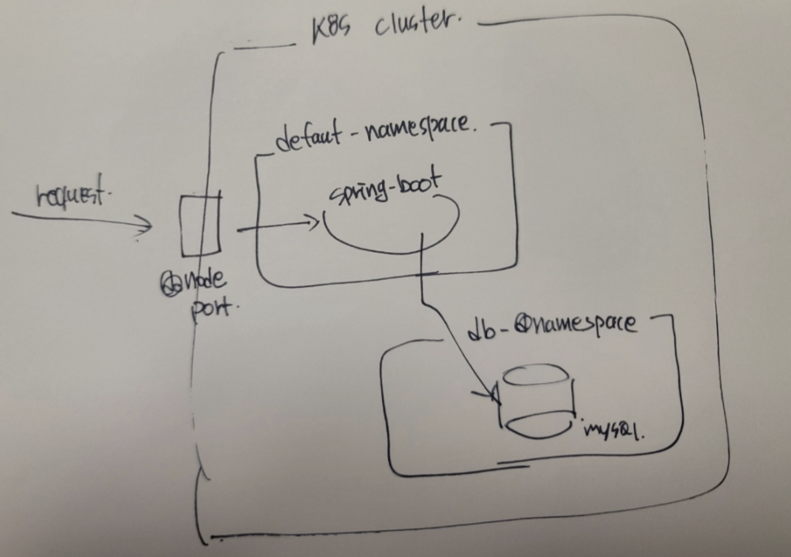

## k8s로  spring boot + mysql 띄우기

### 실습 내용
- spring boot + my sql 띄우기
- lb 붙여서 트래픽 분산 시키기
- jenkins 구성하여 CICD 구성 하기
- 트래픽 흘려서 auto scaling 구성하기

### docker build

~~~ shell
docker build --tag boriswinter/biggwang-boot .

# -d 옵션은 background
docker run -d -p 8080:8080 biggwang-server 

# docker hub에 push 하려면 id를 꼭 넣어줘야 함
docker push boriswinter/biggwang-server:latest 

# 로그 보기
docker logs -f {id}
~~~

### k8s 구성하기

~~~ shell
# db 구성
kubectl create namespace db-zone
kubectl apply -f mysql-deployment.yaml --namespace=db
kubectl apply -f mysql-service.yaml --namespace=db

# mysql db 구성 (pod 접속)
kubectl get pods --namespace=db
kubectl -n mysql-zone exec -it myweb-mysql-k5wg4 bash

mysql -uroot -ppassword
create database biggwnag;
~~~

~~~ shell
# boot 구성
kubectl apply -f biggwang-deployment.yaml
kubectl apply -f biggwang-service.yaml
~~~

### k8s 접속

ipconfig 입력 후 en0: 부분 ip로 접속한다
http://{k8s_ip}:{node_port}/biggwang

### 알게된 내용

- 네임스페이스 삭제하면 그 안에 속해있는 리소스 모두 제거 된다고 함
- 로드밸런서를 하지 않으니까 고르게 분배 되지 않음 계속 한쪽 서버에게만 트래픽이 감;;;